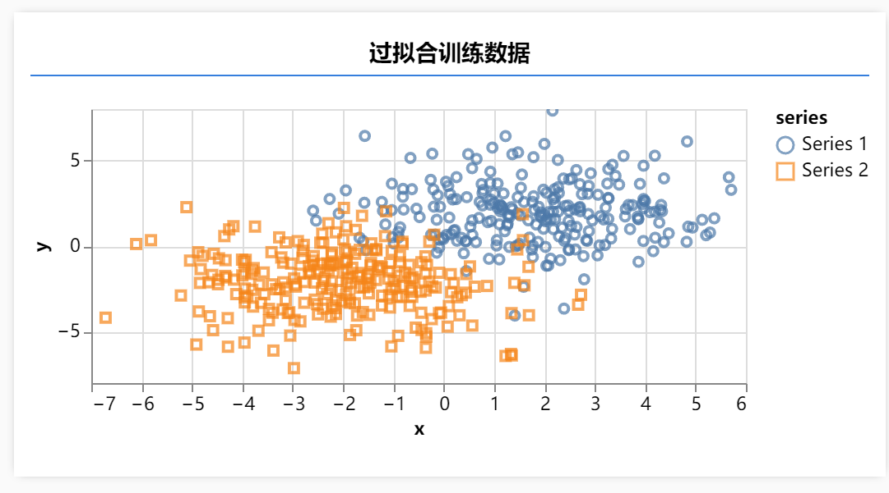
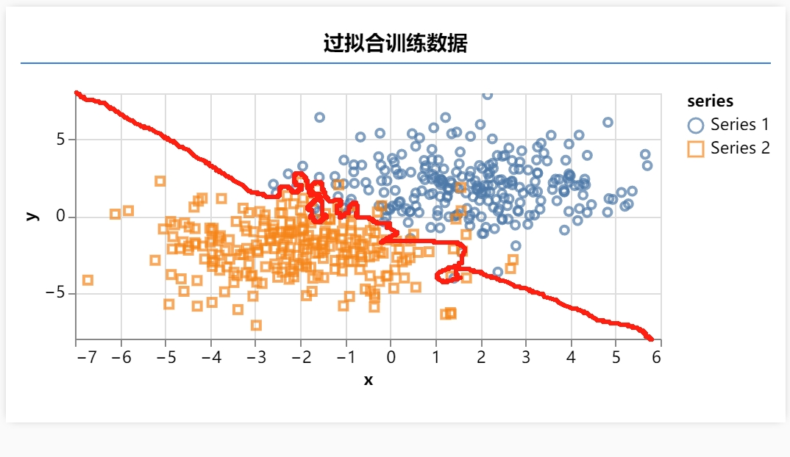
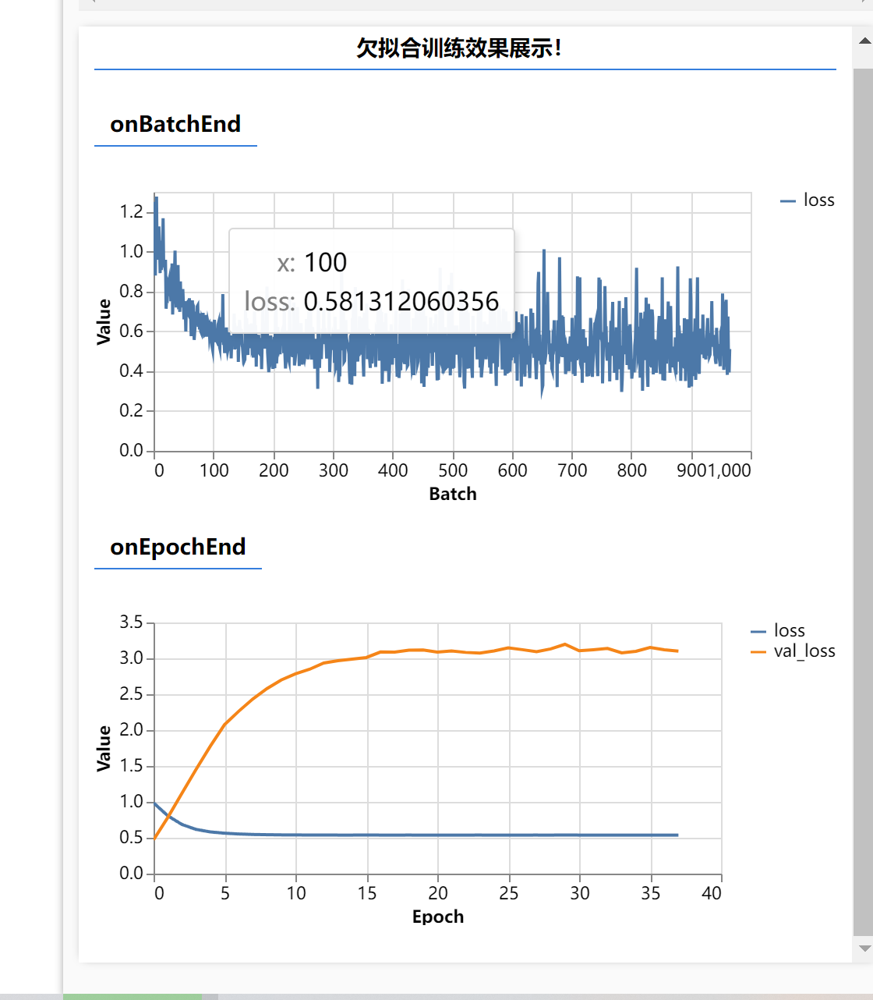

# 什么是欠拟合和过拟合？

欠拟合和过拟合是机器学习中常见的问题，它们涉及模型在处理数据时的性能表现。让我们用生活中的例子来解释这两个概念。

欠拟合 可以类比为学生没有充分掌握知识的情况。就像一个学生在准备数学考试时只阅读了一遍课本，没有进行足够的练习和复习，在考试中可能无法正确回答一些基本的问题。在机器学习中，欠拟合指的是模型无法很好地拟合数据，通常是由于模型过于简单或者没有充分训练所导致的。这意味着模型对于训练数据和新数据的表现都比较差，无法很好地进行预测。

过拟合 可以类比为一个学生死记硬背考试范围内的所有问题，但对于类似但不完全相同的新问题却无法灵活应对。就好像一个学生死记硬背了上一年的考试题目，导致在今年的考试中遇到稍微变化的问题就无法回答。在机器学习中，过拟合指的是模型在训练数据上表现很好，但在新数据上表现较差的情况。这通常是由于模型过于复杂，或者训练数据不够多样化所导致的。

希望以上的生活例子能帮助你更好地理解欠拟合和过拟合这两个概念。

# 过拟合
过拟合就是用 复杂的模型 去拟合 简单的数据 导致 模型的泛化能力 变差
我们运行后可以看到这样的一个图

这个图如果让我们人类去分类 你指定从左上角到右下角一刀切 但是机器会怎么搞
请看 img！

他大概会这样去分类 这样就是过拟合 分的太细了他把噪音数据都分了 什么是噪音数据？
就是蓝色区域有黄色 黄色区域有蓝色
解决方案：

1.  增加更多的训练数据
2.  使用更复杂的模型
3.  正则化
4.  交叉验证

# 那么我们对于噪音数据要不要分类呢？

噪音数据就是那些不属于训练集的测试集数据 我们不知道他属于哪一类 但是我们知道他是噪音数据 所以我们不应该把他分类到任何一类 我们应该把他当作噪音数据来看待

# 欠拟合呢？

欠拟合就是用简单模型 去解决复杂问题 就会造成欠拟合问题！

这个案例就是用一个神经元去处理 XORsetData 但是这个神经元太简单了 他只能处理线性关系 所以他欠拟合了 所以我们要用更复杂的模型去解决这个问题！

解决方案：

1.  增加更多的神经元
2.  使用更复杂的模型
3.  正则化
4.  交叉验证
5.  早停法